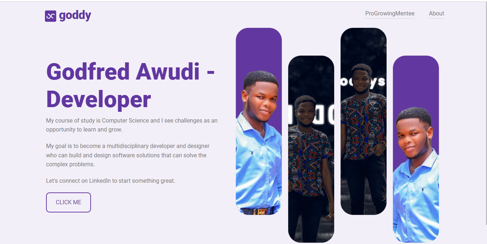

# Landing Project

Welcome to the Landing Project! This project showcases a personal landing page with information about Godfred Awudi, a developer passionate about learning and growing in the field of Computer Science.

## Screenshot


## Table of Contents
- [Installation](#installation)
- [Usage](#usage)
- [Project Structure](#project-structure)


# Installation

Follow these steps to set up the project on your local machine:

1. **Clone the Repository:**
   ```bash
   git clone https://github.com/your-username/landing-project.git
   cd landing-project


### Install Dependencies:

Assuming you have Node.js and npm installed
```bash
    npm install
    Run the Application:
```

```bash
    npm start
    Open your web browser and go to http://localhost:3000 to view the landing page.
```

# Usage
The landing page consists of a header and a main section with a hero banner showcasing Godfred Awudi's profile. You can explore the content and click the "Click Me" button to connect with Godfred on LinkedIn.

# Project Structure
### main.jsx: Entry point of the application, rendering the App component.
### App.jsx: Main component containing the structure of the landing page, including the header and hero section.
### Header.jsx: Component for the header, displaying the project logo and navigation links.
### App.css: Stylesheet for the landing page components.


